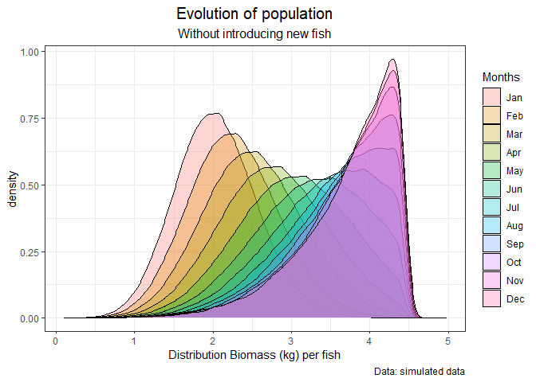

Salmon code challenge
================

# Introduction

For an average weight, we assume normal distributed size of the fish
around this mean and the standard deviations given in Table 1 in the
attached Excel file. For each month in a year, we have the number of
individuals and the total biomass in a cage (Table 2).

1.  How would you go about calculating the total harvestable biomass
    (fish larger than 4kg) for these months?

2.  What is the average weight of these (harvestable) fish?

3.  Assuming you only know the biomass and number of individuals at the
    start of the first month (from table 2). Assume a growth rate of
    11.2%. How much will be harvested during the next 12 months, if we
    assume that all fish over 4kg will be harvested at the end of each
    month?

4.  Do you see any other interesting questions we could try to answer
    with these or similar kind of data?

# Load data

Here we load the library that are used for the analysis

``` r
library(data.table)
library(readxl)
library(ggplot2)
```

Let’s load the dataset from the excel file.

-   The first table (**Table 1**) is stored in `weight` object
-   The second table (**Table 2**) is the `time_series` object

``` r
data_path = "Data Scientist assigment - Backround data.xlsx"
weight = data.table(read_xlsx(data_path,sheet = 1))
time_series = data.table(read_xlsx(data_path,sheet = 2,skip = 1,
                                   col_names = c("Month","Number of individuals",
                                                 "Biomass")))
```

# Analysis

## Answer 1 & 2

In order to answer to the first question we need to know the
distribution of the weight for the overall population of fish. We know
for each month the number of fish and the total biomass in a cage. We
assume that the distribution of the population follows a *Poisson
distribution*: we picked this distribution because we need a discrete
probability distribution, skewed and non-negative. We have to define the
*λ* parameter of the distribution according to the data, each month will
have a different distribution with a different *λ* parameter.

Based on the data we have *61* categories of weight and each category is
normally distributed with mean and standard deviation given as input.
The following function is the objective function that will be optimized
(finding the optimum *λ*) according to the data. The function work as
follow:

-   Fixed a seed to have reproducibility (`set.seed(90)`)
-   Use the poisson distribution to define the number of fish per
    category of weight (here the parameter *λ* is the goal of the
    optimization that will give us the proportion of fish for each
    category of weight)
-   Assign one of the category to each simulated fish (according to the
    population proportion)
-   Use the function `gen_weight` to simulate the weight for each fish
    and compute the overall sum (because in `time_series` we have number
    of fishes and total biomass)

``` r
gen_weight = function(dt){
  tmp = sapply(1:NROW(dt), function(i){
    round(rnorm(n = dt$pop_p[i],
                mean = dt$`Average weight`[i],
                sd = dt$`std (s)`[i]),3)
  })
  tmp = do.call(c,tmp)
  return(tmp)
}

opt_function = function(weight,par,n_pop,biomass){
  set.seed(90)
  weight[, prop_p := dpois(0:60,par)]
  tmp = sample(61,n_pop, replace = T,prob = weight$prop_p)
  pop_group = rep(0,61)
  pop_group[as.numeric(names(table(tmp)))] = table(tmp)
  weight[, pop_p := pop_group]
  return(abs(round(sum(gen_weight(dt = weight)),0) - biomass))
}
```

Now we find the optimal *λ* that minimize the difference between
simulated data and the input data, we are using a simple optimizer
because we have only one parameter to optimize for each month:

``` r
time_series$lambda = NA
tmp = lapply(1:NROW(time_series), function(i){
  time_series$lambda[i] <<- optim(c(2.5),
                                  method = "L-BFGS-B",
                                  opt_function,
                                  weight = weight,
                                  lower = 2, 
                                  upper = 40,
                                  n_pop = time_series$`Number of individuals`[i],
                                  biomass = time_series$Biomass[i])$par
})

time_series
```

<div class="kable-table">

| Month | Number of individuals | Biomass |    lambda |
|:------|----------------------:|--------:|----------:|
| Jan   |                156077 |  317895 |  5.367418 |
| Feb   |                153515 |  348611 | 10.948178 |
| Mar   |                149766 |  372454 |  9.850664 |
| Apr   |                143869 |  392922 | 12.334733 |
| May   |                135885 |  404041 | 14.732522 |
| Jun   |                121411 |  381604 | 16.437873 |
| Jul   |                103747 |  348771 | 18.560533 |
| Aug   |                 82179 |  296803 | 21.727435 |
| Sep   |                 61159 |  237555 | 23.743049 |
| Oct   |                 43519 |  178965 | 26.024463 |
| Nov   |                 30066 |  130021 | 28.291321 |
| Dec   |                 19175 |   86197 | 29.857117 |

</div>

Now we use the *λ* values to make some simulations in order to answer to
the first question. We use lambda to generate 1000 scenarios for each
month and compute the total harvestable biomass for each month:

-   Write a function to provide the different scenarios
-   Set the desired parameters
-   The output will be a `data.table` with the number of column equal to
    the number of simulation and the number of row is the number of
    fishes (population given by the data)

``` r
sim_function = function(n_pop,lambda,nsim,weight){
  prop_p = dpois(0:60,lambda)
  tmp = sample(61,n_pop, 
               replace = T, prob = prop_p)
  pop_group = rep(0,61)
  pop_group[as.numeric(names(table(tmp)))] = table(tmp)
  
  sim = lapply(1:nsim,function(j){
    tmp_sim = sapply(1:NROW(pop_group), function(i){
      tmp = round(rnorm(n = pop_group[i],
                  mean = weight$`Average weight`[i],
                  sd = weight$`std (s)`[i]),3)
       tmp[tmp < 0.1] = 0.1 # adjust for non negative weight
      return(tmp)
      })
    do.call(c,tmp_sim)
  })
  sim = do.call(cbind,sim)
  sim = as.data.table(sim)
  setnames(sim,names(sim),paste0("sim",1:nsim))
  return(sim)
}
```

Now we can run the simulation for each month and given the total compute
the total harvestable biomass for each month (in terms of kg and % on
the total biomass)

``` r
sim_results = lapply(1:NROW(time_series), function(i){
  #print(paste0("Simulation: ",time_series$Month[i]))
  set.seed(90)
  sim_function(n_pop = time_series$`Number of individuals`[i],
               lambda = time_series$lambda[i],
               nsim = 1000,
               weight = weight)
})
names(sim_results) = time_series$Month
```

For each month we have 1000 simulated population given the parameter
estimated before and using the distribution of the weights for each
category. Where we can compute the total harvestable biomass (we could
even compute 95% CI) \[question 1\] and the average weight for the
harvested biomass \[question 2\]. The results are in the following
table:

``` r
time_series$HBiomass = NA
# time_series$HBiomass_0.025 = NA
# time_series$HBiomass_0.975 = NA
time_series$MHBiomass = NA

for(i in 1:NROW(time_series)){
  sum_hbio = sapply(1:NCOL(sim_results[[i]]), function(j){
    sim = sim_results[[i]][,j,with=F][[1]]
    sum(sim[sim>4])
  }) 
  
  mean_hbio = sapply(1:NCOL(sim_results[[i]]), function(j){
    sim = sim_results[[i]][,j,with=F][[1]]
    mean(sim[sim>4])
  }) 
  
  time_series$HBiomass[i] <- mean(sum_hbio)
  # time_series$HBiomass_0.05[i] <- quantile(tmp,0.025)
  # time_series$HBiomass_0.975[i] <- quantile(tmp,0.975)
  time_series$MHBiomass[i] <- mean(mean_hbio)
}
time_series[,`% harvested SIM` := round(100*(HBiomass/Biomass),2)]
time_series
```

<div class="kable-table">

| Month | Number of individuals | Biomass |    lambda |   HBiomass | MHBiomass | % harvested SIM |
|:------|----------------------:|--------:|----------:|-----------:|----------:|----------------:|
| Jan   |                156077 |  317895 |  5.367418 |    382.697 |  4.208929 |            0.12 |
| Feb   |                153515 |  348611 | 10.948178 |  19171.250 |  4.359441 |            5.50 |
| Mar   |                149766 |  372454 |  9.850664 |  11012.491 |  4.325979 |            2.96 |
| Apr   |                143869 |  392922 | 12.334733 |  31505.199 |  4.403173 |            8.02 |
| May   |                135885 |  404041 | 14.732522 |  64164.940 |  4.489704 |           15.88 |
| Jun   |                121411 |  381604 | 16.437873 |  86646.906 |  4.556522 |           22.71 |
| Jul   |                103747 |  348771 | 18.560533 | 112863.562 |  4.651450 |           32.36 |
| Aug   |                 82179 |  296803 | 21.727435 | 139244.403 |  4.802334 |           46.91 |
| Sep   |                 61159 |  237555 | 23.743049 | 129595.207 |  4.911723 |           54.55 |
| Oct   |                 43519 |  178965 | 26.024463 | 112613.480 |  5.042027 |           62.92 |
| Nov   |                 30066 |  130021 | 28.291321 |  90438.904 |  5.168111 |           69.56 |
| Dec   |                 19175 |   86197 | 29.857117 |  63669.451 |  5.266896 |           73.87 |

</div>

## Answer 3

Here we want to estimate the total harvastable biomass during a whole
year considering only the initial parameters of number of fish, total
biomass and growth rate of the fish. Let’s use the same parameter
estimated for the first two questions and we simulate different
scenarios. We create the evolution function to analyze different
scenarios. In the following plot we can see the evolution of the total
biomass according to the parameters and the distributions:

``` r
evolution_function = function(n_pop,lambda,nsim,weight,gr,epoch,treshold){
  tmp = matrix(NA, n_pop,epoch)
  tmp[,1] = sim_function(n_pop = n_pop,
               lambda = lambda,nsim = nsim,weight = weight)[[1]]
  
  for(i in 2:epoch){
    tmp[,i] = tmp[,i-1]*(1+gr)*ifelse(tmp[,i-1]>treshold,NA,1)
  }
  
  tmp = as.data.table(tmp)
  setnames(tmp,names(tmp),c("Jan","Feb","Mar","Apr","May","Jun",
                            "Jul","Aug","Sep","Oct","Nov","Dec"))
  return(tmp)
}

example = evolution_function(n_pop = time_series$`Number of individuals`[1],
                             lambda = time_series$lambda[1],nsim = 1,
                             weight = weight, gr = 0.112,epoch = 12,
                             treshold = 4)

example_melt = suppressWarnings(melt(example))
setnames(example_melt,"variable","Months")


ggplot(example_melt, aes(x=value, fill=Months)) +
  geom_density(alpha=0.3)+ 
  labs(x= "Distribution Biomass (kg) per fish",
       title="Evolution of population",
       subtitle = "Without introducing new fish",
       caption="Data: simulated data") +
  theme_bw() +
  theme(plot.title = element_text(hjust = 0.5, size = 15),
        plot.subtitle = element_text(hjust = 0.5, size = 12))
```

    ## Warning: Removed 617030 rows containing non-finite values (stat_density).



Now we can make the set of simulation to answer the question number 3:

``` r
simulation_evolution = lapply(1:1000,function(j){
  tmp = evolution_function(n_pop = time_series$`Number of individuals`[1],
                             lambda = time_series$lambda[1],nsim = 1,
                             weight = weight, gr = 0.112,epoch = 12,
                             treshold = 4)
  data.table(t(apply(tmp,2,function(x) sum(x[x>4],na.rm = T))))
})

simulation_evolution = rbindlist(simulation_evolution)
biomass_year = apply(simulation_evolution,1,sum)
```

the overall harvested biomass during a year following the initial
parameters of number of fish, total biomass and growth rate of the fish
is 619678.505 with a confidence interval of (618958.065; 620408.692)

## Answer 4

Using this data or similar data we could do a lot of interesting things:

-   We can try different population distribution
-   Trying a theory approach based on the distirbutions
-   We can make simulation with the grow rate as a distribution
-   We can make model with introduction of a fixed amount of fish
-   Having price based on the single fish and the biomass we can make
    some cash flow prediction
